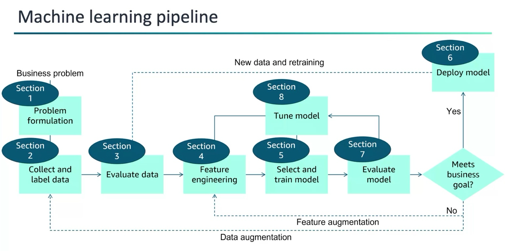

### **Pipeline de Machine Learning : Étapes**

---

#### **1. Formulation du Problème (Section 1)**
- **Objectif** : Définir clairement ce qu’on veut résoudre avec le Machine Learning.
  - Exemple : Est-ce qu’on veut prédire un chiffre (régression) ou classer des catégories (classification) ?
- Comprendre ce que l’entreprise ou le projet attend : qu’est-ce qui est important à prédire ou à améliorer ?

---

#### **2. Collecte et Étiquetage des Données (Section 2)**
- **Objectif** : Rassembler les données nécessaires pour entraîner le modèle.
  - Sources : Bases de données, fichiers Excel, APIs, etc.
- **Étiquetage** : Si on fait de l’apprentissage supervisé, il faut associer chaque donnée à une "réponse" (label).
  - Exemple : Pour un email, est-ce que c’est un spam ou non-spam ?
- Important d’avoir des données **variées** et **représentatives** du problème.

---

#### **3. Évaluation des Données (Section 3)**
- **Objectif** : Vérifier la qualité des données.
  - Y a-t-il des **données manquantes** ? Des **erreurs** ? Des **valeurs aberrantes** ?
- Faire une **analyse exploratoire** : Voir comment sont réparties les données, identifier des tendances, corrélations.
  - Si les données ne sont pas bonnes ou incomplètes, il faut peut-être retourner à la collecte des données.

---

#### **4. Ingénierie des Caractéristiques (Section 4)**
- **Objectif** : Transformer les données pour que le modèle puisse les utiliser.
  - Exemple : Si une donnée est une date, on peut en extraire des infos comme le jour de la semaine.
- **Créer de nouvelles variables** ou modifier celles qui existent pour qu’elles aient plus de sens pour le modèle.
- **Réduire la complexité** si trop de caractéristiques (exemple : PCA, réduction de dimensionnalité).

---

#### **5. Sélection et Entraînement du Modèle (Section 5)**
- **Objectif** : Choisir le modèle et l’entraîner.
  - **Modèle** : Il existe différents algorithmes (régression linéaire, arbres de décision, réseaux de neurones…).
  - Séparer les données en **données d’entraînement** et **données de test**.
- **Entraîner le modèle** : Le modèle apprend à partir des données d’entraînement.
  - Exemple : Le modèle apprend à prédire si un email est un spam ou non.
- **Réglage des hyperparamètres** : Ajuster les paramètres du modèle pour améliorer les performances.

---

#### **6. Déploiement du Modèle (Section 6)**
- **Objectif** : Mettre le modèle en production pour qu’il puisse faire des prédictions sur de nouvelles données.
  - Exemple : Le modèle doit être utilisé dans une application ou un site web pour faire des prédictions en temps réel (comme recommander des produits à des clients).
- **Scalabilité** : S’assurer que le modèle peut gérer beaucoup de nouvelles données sans problème.

---

#### **7. Évaluation du Modèle (Section 7)**
- **Objectif** : Tester le modèle avant de le déployer complètement.
  - Utiliser des **données de validation** pour voir comment le modèle se comporte avec des données qu’il n’a jamais vues.
- **Métriques de performance** : Calculer des scores comme la **précision**, le **rappel**, ou le **F1-score** pour savoir si le modèle est bon.
  - Si le modèle n’est pas assez performant, il faut retourner à l’étape suivante pour l’améliorer.

---

#### **8. Réglage et Amélioration du Modèle (Section 8)**
- **Objectif** : Améliorer les performances du modèle si nécessaire.
  - **Ajuster les hyperparamètres** : Tester différentes configurations pour améliorer les résultats.
  - **Ajouter de nouvelles données** : Collecter plus de données ou enrichir les données existantes.
  - **Améliorer les caractéristiques** : Revoir l’ingénierie des caractéristiques, ajouter des variables ou améliorer celles qui existent.

---

### **Boucle de Réitération**
- Si le modèle n’atteint pas les objectifs après évaluation (Section 7), il est souvent nécessaire de **revenir en arrière** pour ajuster les caractéristiques ou entraîner à nouveau le modèle avec plus de données.
- Ce processus est souvent itératif jusqu’à ce que le modèle réponde aux attentes.