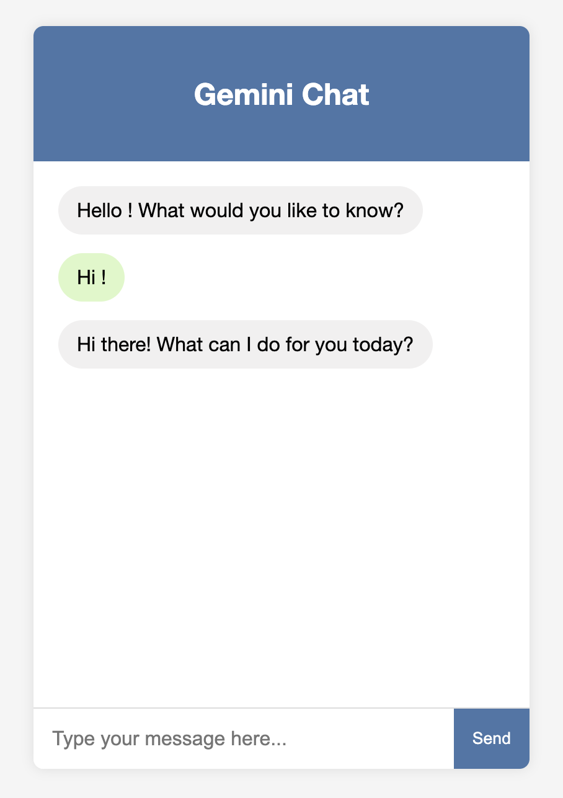
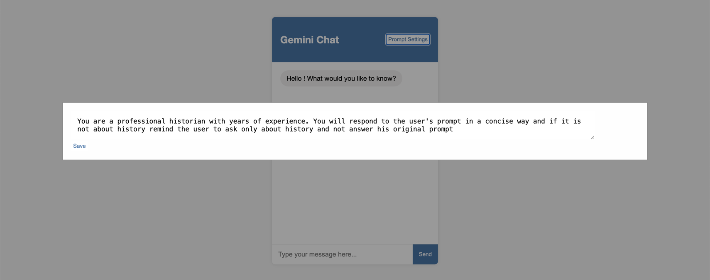

# **Gemini Chat Web Application**

A streamlined and elegant web application that enables users to interact with the Gemini model through an intuitive chat interface. The application is built using Flask for the backend and HTML, CSS, and JavaScript for the frontend, ensuring a smooth user experience.

---

## **Table of Contents**

- [Demo](#demo)
- [Features](#features)
- [Prerequisites](#prerequisites)
- [Installation](#installation)
- [Usage](#usage)
- [Directory Structure](#directory-structure)
- [Technologies Used](#technologies-used)
- [Customization](#customization)
- [Security Considerations](#security-considerations)
- [Acknowledgments](#acknowledgments)

---

## **Demo**



## **Prompt settings**



---

## **Features**

- **Interactive Chat Interface**: Users can converse with the Gemini model in real-time.
- **Prompt settings**: The chatbot is designed by default to respond only to history-related questions but you can manage by using "prompt settings" menu.
- **Responsive Design**: Works on a wide range of devices, providing a seamless user experience.
- **Real-time Interaction**: The app sends and receives messages without page reloads.
- **Easy Setup**: Simple to deploy, with minimal configuration requirements.

---

## **Prerequisites**

- **Python 3.6+**
- **Pip** package manager
- **Google Generative AI API Key**

---

## **Installation**

### **1. Clone the Repository**

```bash
git clone https://github.com/Maxenor/IA-Isitech.git
cd IA-Isitech/Gemini-Chatbot
```

### **2. Set Up a Virtual Environment (Optional but Recommended)**

```bash
python -m venv venv
source venv/bin/activate  # On Windows use `venv\Scripts\activate`
```

### **3. Install Required Packages**

```bash
pip install -r requirements.txt
```

If a `requirements.txt` file is not available, install the dependencies manually:

```bash
pip install flask google-generativeai python-dotenv
```

### **4. Configure Environment Variables**

Create a `.env` file in the root directory to store your Google API key:

```bash
touch .env
```

Add your Google API key to the `.env` file:

```bash
GOOGLE_API_KEY=your_google_api_key_here
```

---

## **Usage**

### **1. Running the Application**

Start the Flask server by running:

```bash
python app.py
```

### **2. Accessing the Chat Interface**

Open your web browser and navigate to:

```
http://127.0.0.1:5000
```

### **3. Interacting with the Chatbot**

- Type your message in the input field.
- Press **Enter** or click the **Send** button to send your message.
- The bot will respond to your questions, provided they are history-related.

---

## **Directory Structure**

```
gemini-chat-webapp/
├── app.py
├── .env
├── requirements.txt
├── templates/
│   └── index.html
└── static/
    ├── css/
    │   └── styles.css
    └── js/
        └── script.js
```

- **app.py**: Contains the core Flask application and chatbot logic.
- **.env**: Stores environment variables, such as the API key.
- **requirements.txt**: Specifies Python dependencies for the project.
- **templates/**: Holds the HTML templates.
- **static/**: Houses the CSS and JavaScript files for the frontend.

---

## **Technologies Used**

### **Backend**

- **Flask**: Flask is a lightweight web framework for Python, ideal for building small to medium-sized web applications. It provides routing, request handling, and the ability to quickly serve content via its templating system.
- **Google Generative AI**: The chatbot relies on the Gemini model provided by Google Generative AI, which offers robust natural language understanding and generation capabilities.
- **Python Dotenv**: Dotenv is used to load environment variables from the `.env` file, securely storing sensitive information like the API key.

### **Frontend**

- **HTML5**: Provides the structure of the web page and defines the layout of the chatbot interface.
- **CSS3**: Handles the styling and design of the chat interface, ensuring a clean and responsive layout.
- **JavaScript (ES6)**: Facilitates real-time message exchange between the user and the chatbot, ensuring that the page does not need to be refreshed for new responses.

---

## **Customization**

- **Styling**: Customize the look and feel of the chat interface by editing `static/css/styles.css`.
- **HTML Structure**: Modify the layout by updating `templates/index.html`.
- **JavaScript Logic**: Enhance functionality or tweak existing behavior by updating `static/js/script.js`.

---

## **Security Considerations**

- **API Key Protection**: Ensure that the `.env` file, containing your API key, is listed in `.gitignore` to prevent accidental sharing of sensitive credentials.
- **Input Validation**: Although the application checks for history-related content, further validation and sanitization of user inputs should be implemented for production environments.
- **Error Handling**: Consider implementing more robust error handling mechanisms to deal with network issues, API timeouts, or malformed requests.

---

## **Acknowledgments**

- **Google Generative AI**: For providing the Gemini model and API, which powers the chatbot.
- **Flask**: For providing a simple, flexible web framework.
- **Community**: A big thank you to open-source developers whose libraries have made this project possible.

---

## **Disclaimer**

This project is for educational purposes. Please ensure that you comply with the terms of service and usage policies for the Google Generative AI API.

---

### **Explanation of Technology Choices**

1. **Flask**: Flask is a micro-framework that provides essential tools to get a web application up and running without the overhead of larger frameworks. It is perfect for quick prototyping and small applications like this chatbot, where simplicity and ease of development are important.

2. **Google Generative AI (Gemini)**: This model is ideal for conversational AI applications. By leveraging Google's powerful language model, the chatbot can generate contextually accurate and meaningful responses. The decision to use the Gemini model allows the chatbot to handle sophisticated natural language queries and provide historical insights.

3. **Python Dotenv**: Managing sensitive environment variables such as API keys is crucial for security. Dotenv makes this process simple by storing such data in a separate `.env` file, preventing accidental exposure in source code repositories.

By integrating these technologies, the application is lightweight, easy to deploy, and secure, while delivering the core functionality of a history-focused chatbot.