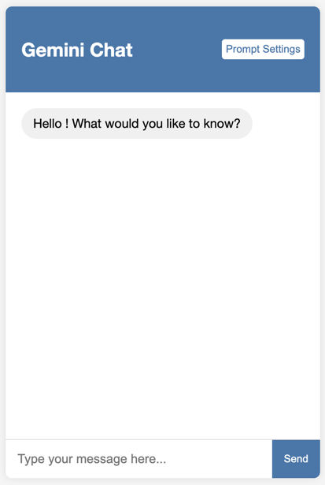

# **Gemini Chat Web Application**

A simple and elegant web application that allows users to interact with the Gemini model through a chat interface. Built with Flask for the backend and HTML, CSS, and JavaScript for the frontend.

---

## **Table of Contents**

- [Demo](#demo)
- [Features](#features)
- [Prerequisites](#prerequisites)
- [Installation](#installation)
- [Usage](#usage)
- [Directory Structure](#directory-structure)
- [Technologies Used](#technologies-used)
- [Customization](#customization)
- [Security Considerations](#security-considerations)
- [Acknowledgments](#acknowledgments)

---

## **Demo**



---

## **Features**

- Interactive chat interface with the Gemini model.
- Responsive design suitable for various screen sizes.
- Smooth user experience with real-time message exchange.
- Easy to set up and customize.

---

## **Prerequisites**

- **Python 3.6+**
- **Pip** package manager
- **Google Generative AI API Key**

---

## **Installation**

### **1. Clone the Repository**

```bash
git clone https://github.com/Maxenor/IA-Isitech.git
cd IA-Isitech/Gemini-Chatbot
```

### **2. Set Up a Virtual Environment (Optional but Recommended)**

```bash
python -m venv venv
source venv/bin/activate  # On Windows use `venv\Scripts\activate`
```

### **3. Install Required Packages**

```bash
pip install -r requirements.txt
```

If a `requirements.txt` file is not provided, install the packages manually:

```bash
pip install flask google-generativeai python-dotenv
```

### **4. Configure Environment Variables**

Create a `.env` file in the root directory and add your Google API key:

```bash
touch .env
```

Add the following line to the `.env` file:

```
GOOGLE_API_KEY=your_google_api_key_here
```

---

## **Usage**

### **1. Running the Application**

Start the Flask server by running:

```bash
python app.py
```

### **2. Accessing the Chat Interface**

Open your web browser and navigate to:

```
http://127.0.0.1:5000
```

### **3. Interacting with the Chatbot**

- Type your message in the input field at the bottom.
- Press **Enter** or click the **Send** button to send your message.
- The bot's responses will appear in the chat window.

---

## **Directory Structure**

```
gemini-chat-webapp/
├── app.py
├── .env
├── requirements.txt
├── templates/
│   └── index.html
└── static/
    ├── css/
    │   └── styles.css
    └── js/
        └── script.js
```

- **app.py**: The main Flask application file.
- **.env**: Contains environment variables like the API key.
- **requirements.txt**: List of Python dependencies.
- **templates/**: Directory for HTML templates.
- **static/**: Contains static assets like CSS and JavaScript files.

---

## **Technologies Used**

- **Backend**: Flask, Google Generative AI Python Client, Python Dotenv
- **Frontend**: HTML5, CSS3, JavaScript (ES6)
- **Styling**: Custom CSS

---

## **Customization**

- **Styling**: Modify `static/css/styles.css` to change the look and feel of the chat interface.
- **Templates**: Edit `templates/index.html` to alter the HTML structure.
- **JavaScript Logic**: Update `static/js/script.js` to add new functionalities or modify existing ones.

---

## **Security Considerations**

- **API Key Safety**: Ensure your `.env` file is included in your `.gitignore` file to prevent it from being committed to any public repositories.
- **Input Validation**: While the app includes basic error handling, consider adding more robust input validation and sanitization for production environments.
- **Error Handling**: Implement comprehensive error handling to manage exceptions and unexpected behavior gracefully.

---

## **Acknowledgments**

- **Google Generative AI**: For providing the Gemini model and API.
- **Flask**: For being a simple yet powerful web framework.
- **Community**: Thanks to all the open-source contributors whose libraries and tools made this project possible.

---

*Feel free to contribute to this project by opening issues or submitting pull requests.*

---

**Disclaimer**: This project is intended for educational purposes. Please make sure to comply with all relevant terms of service and usage policies when using the Google Generative AI API.